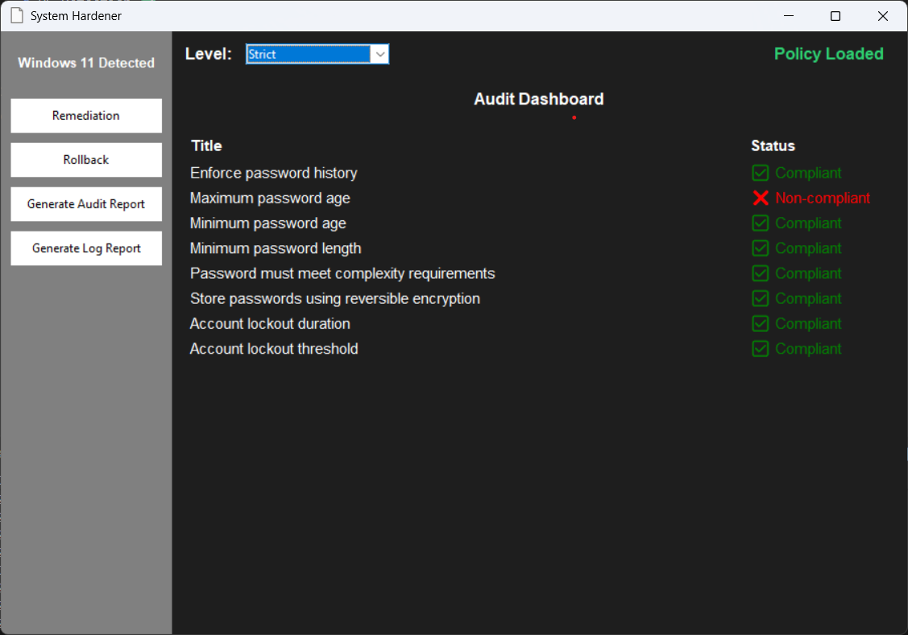

# System Hardener

**System Hardener** is a cross-platform security auditing and remediation tool designed to help administrators enforce system hardening policies on Windows and Linux systems. It provides an intuitive GUI, automated auditing, snapshot-based remediation, rollback capabilities, and detailed logging for compliance tracking.

---

## 🌟 Key Features

| Feature                        | Description                                                                | Status |
| ------------------------------ | -------------------------------------------------------------------------- | ------ |
| OS Detection                   | Automatically detects the underlying OS (Windows/Linux/CentOS)             | ✅      |
| Root/Admin Privilege Detection | Checks for administrative/root access and prompts if needed                | ✅      |
| Policy Loading                 | Supports loading of pre-defined hardening policies from YAML configuration | ✅      |
| Audit                          | Generates detailed audit reports of system compliance                      | ✅      |
| Snapshot & Remediation         | Captures system snapshots and allows automated remediation                 | ✅      |
| Rollback                       | Reverts changes to previously captured system states                       | ✅      |
| Logging                        | Generates comprehensive log reports for auditing and troubleshooting       | ✅      |

---

## 🚀 Planned Improvements

* Expand policy coverage with additional rules from **Annexure_A_B.pdf** in the `assets` folder.

  * Windows: `policy_windows.yaml`
  * Ubuntu: `policy_ubuntu.yaml`
  * CentOS: `policy_centos.yaml`
* Enhance GUI for improved usability and responsiveness.
* CLI Support Can Be Added  
* Extend support for additional operating systems.

---

## 🎨 Application Showcase


*Example of System Hardener GUI interface*

---

## 📄 YAML Policy Structure

System Hardener uses YAML-based policy definitions for flexibility and ease of updates. Each rule defines what needs to be audited or remediated.

| Field                         | Description                                              |
| ----------------------------- | -------------------------------------------------------- |
| **id**                        | Unique identifier for the rule, e.g., `accPol-a-01`      |
| **category**                  | Rule category, e.g., *Account Password Policy*           |
| **title**                     | Short descriptive name of the rule                       |
| **description**               | Detailed explanation of the rule                         |
| **severity**                  | Importance of the rule (`high`, `medium`, `low`)         |
| **level**                     | Security level (`basic`, `moderate`, `strict`)           |
| **parameter_name**            | Registry key or system parameter being configured        |
| **default_remediation_value** | Recommended value to remediate the system                |
| **check_command**             | Command(s) used to audit the current system value        |
| **remediation_command**       | Command(s) used to apply the recommended setting         |
| **rollback_value**            | Original value to revert if needed                       |
| **enabled**                   | Whether the rule is active (`true` / `false`)            |
| **logic**                     | Logical expression to evaluate compliance, e.g., `>= 24` |

---

## 📝 Example Policy (`policy.yaml`)

```yaml
rules:
- id: accPol-a-01
  category: Account Password Policy
  title: Enforce password history
  description: Ensure 'Enforce password history' is set to 24 or more passwords.
  severity: high
  level: basic
  parameter_name: PASS_HISTORY
  default_remediation_value: 24
  check_command:
    - net accounts | findstr /C:"Length of password history maintained"
  remediation_command:
    - net accounts /uniquepw:{value}
  rollback_value:
    - 10
  enabled: true
  logic:
    operator: '>='
    value: 24
```

---

## ⚡ Installation & Setup


### Install Dependencies

```bash
python -m pip install -r requirements.txt
```

### Run the GUI Application

```bash
python GUI.py
```


## 📂 Directory Structure

```
System Hardner
│
├─ assets/                # Assets
│   ├─ Annexure_A_B.pdf
│   ├─ app_icon.png
│   └─ showcase.png
│
├─ logs/                  # Logs
│   └─ 2025-10-16.log
│
├─ policy/                # YAML policy files
│   ├─ policy_centos.yaml
│   └─ policy_windows.yaml
│
├─ reports/               # Generated reports
│   └─ combined_log_report.pdf
│
├─ utils/                 # Core modules
│   ├─ audit.py
│   ├─ generate_audit_report.py
│   ├─ logger.py
│   ├─ os_detect.py
│   ├─ policy_manager.py
│   ├─ remediation.py
│   ├─ rollback.py
│   ├─ root.py
│   └─ snapshot.py
│
├─ GUI.py                 
├─ README.md              
└─ requirements.py       
```
